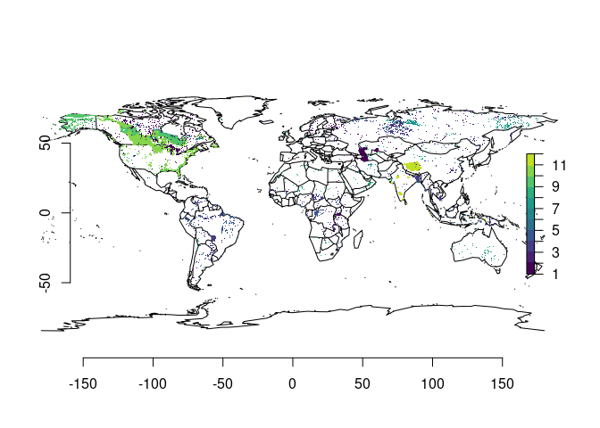

<!-- README.md is generated from README.Rmd. Please edit that file -->

# Global Lakes and Wetlands Database (GLWD) R client

[](http://www.repostatus.org/#active)
[](https://cran.r-project.org/package=glwdr)

## Installation

``` r
devtools::install_github("jsta/glwdr")
```

### Load Package

``` r
library(glwdr)
```

## Usage

### Level 1

``` r
glwd_get(level = 1)

dt <- glwd_load(level = 1)
```

``` r
library(maps)
library(sp)

dt <- dt[dt$COUNTRY == "United States" &
         dt$LAT_DEG < 56 &
         dt$AREA_SKM < 30000,] 
 
map("state")
plot(dt, add = TRUE, col = "blue")
axis(1); axis(2)
```

<!-- -->

### Level 2

``` r
glwd_get(level = 2)

dt <- glwd_load(level = 2)
```

``` r
library(ggplot2)
library(raster)

states <- map_data("state")
states <- glwdr:::map_data_to_spdf(states)
projection(dt) <- projection(states)

map("state")
plot(dt[states,], add = TRUE, border = "blue")
axis(1); axis(2)
```

<!-- -->

### Level 3

``` r
glwd_get(level = 3)

dt <- glwd_load(level = 3)
```

``` r
map("world")
plot(dt, breaks = 1:12, col = viridis::viridis(12), add = TRUE)
axis(1); axis(2)
```

<!-- -->

## References

Lehner, B., Döll, P.: Development and validation of a global database of
lakes, reservoirs and wetlands, Journal of Hydrology, Volume 296, Issues
1–4, 20 August 2004, Pages 1-22,
<http://dx.doi.org/10.1016/j.jhydrol.2004.03.028>.
