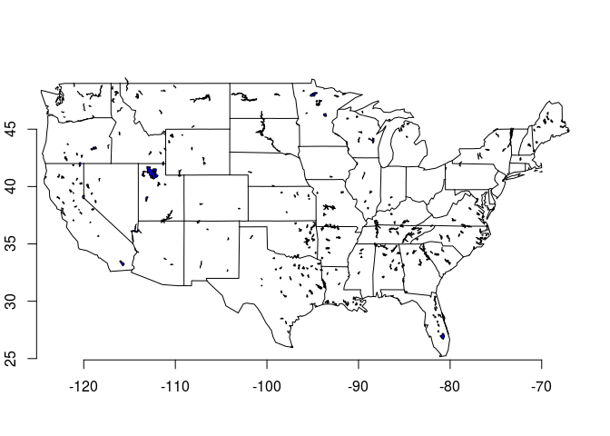
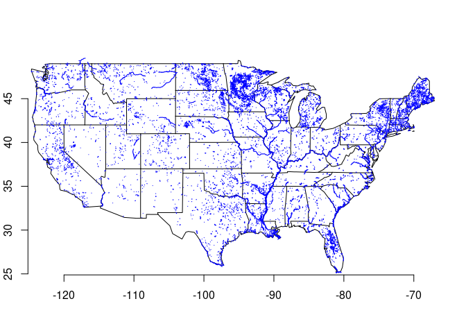
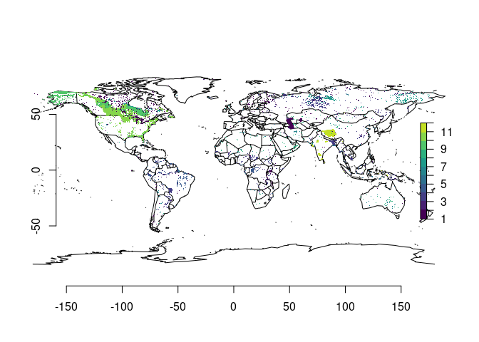

```{r echo=FALSE}
knitr::opts_chunk$set(
  comment = "#>",
  collapse = TRUE,
  warning = FALSE,
  message = FALSE,
  fig.width = 10,
  eval = FALSE)
```
`glwdr` is an R interface to the Global Lakes and Wetlands Database. Capabilities are limited to fetching the data from external sources, caching locally with the `rappdirs` package, and loading from this cache on demand. Although plotting and anaylsis is left to the package user, this document demonstrates some possibilities.

## Installation

```{r eval = FALSE}
devtools::install_github("jsta/glwdr")
```

### Load Package
```{r }
library(glwdr)
```

## Usage

### Level 1
```{r eval=FALSE} 
glwd_get(level = 1)

dt <- glwd_load(level = 1)
```

```{r echo=FALSE,message=FALSE,results='hide'} 
library(glwdr)

dt <- suppressMessages(glwd_load(level = 1))
```

```{r level-1}
library(maps)
library(sp)

dt <- dt[dt$COUNTRY == "United States" &
         dt$LAT_DEG < 56 &
         dt$AREA_SKM < 30000,] 
 
map("state")
plot(dt, add = TRUE, col = "blue")
axis(1); axis(2)
```



```{r echo=FALSE, eval=FALSE}
dt@data[1:5,]
```

### Level 2

```{r eval=FALSE} 
glwd_get(level = 2)

dt <- glwd_load(level = 2)
```

```{r echo=FALSE,message=FALSE,results='hide'} 
library(glwdr)

dt <- suppressMessages(glwd_load(level = 2))
```

```{r level-2}
library(ggplot2)
library(raster)

states <- map_data("state")
states <- glwdr:::map_data_to_spdf(states)
projection(dt) <- projection(states)

map("state")
plot(dt[states,], add = TRUE, border = "blue")
axis(1); axis(2)
```



### Level 3

```{r eval=FALSE}
glwd_get(level = 3)

dt <- glwd_load(level = 3)
```

```{r echo=FALSE,message=FALSE,results='hide',eval=FALSE} 
library(glwdr)

dt <- suppressMessages(glwd_load(level = 3))
```

```{r level-3, eval=FALSE}
map("world")
plot(dt, breaks = 1:12, col = viridis::viridis(12), add = TRUE)
axis(1); axis(2)
```



## References

Lehner, B., Döll, P.: Development and validation of a global
database of lakes, reservoirs and wetlands, Journal of Hydrology, Volume
296, Issues 1–4, 20 August 2004, Pages 1-22,
http://dx.doi.org/10.1016/j.jhydrol.2004.03.028.
